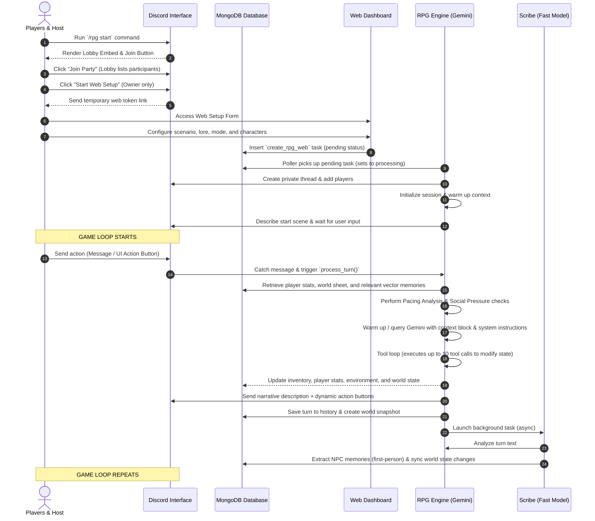

# AnTiMa RPG System Architecture & Guide

Welcome to the comprehensive guide on the **AnTiMa RPG System**. This document outlines the inner workings, database structures, AI engines, processes, and interfaces that drive the immersive multiplayer tabletop role-playing experience built into the AnTiMa Discord Bot.

---

## 🛠️ System Overview & Flow

The AnTiMa RPG system uses a hybrid architecture combining a **Discord Bot Interface** for gameplay and notifications with a **FastAPI Web Dashboard** for configuration, lobby assembly, memory inspection, and live log streaming.

### 🔄 End-to-End Game Flow



---

## 🗄️ Database Architecture (MongoDB)

All RPG-related data is stored across several dedicated collections in MongoDB (`antima_db`). Performance indexes are automatically initialized on startup inside [init_db](file:///a:/Project/VANT%20PROJECT/AnTiMa/utils/db.py#L47-L72).

### RPG Database Collections

| Collection Name | Purpose | Primary Index | Key Fields |
| :--- | :--- | :--- | :--- |
| `rpg_sessions` | Active campaign metadata, player profiles, and full narrative logs. | `thread_id` (Unique) | `owner_id`, `players`, `player_stats`, `scenario_type`, `lore`, `campaign_log`, `turn_history` (with snapshots), `active` (bool), `story_mode` (bool), `ui_mode` |
| `rpg_world_state` | Holds the structured setting context (NPCs, locations, active quests, clocks). | `thread_id` (Unique) | `environment` (time/weather), `story_log` (actions/orders), `quests`, `npcs`, `locations`, `events` |
| `rpg_vector_memory` | Semantic vector space storing past campaign events for similarity retrieval (RAG). | `thread_id` | `text`, `vector` (256-dim), `timestamp`, `metadata` (`type`, `max_turn_id`) |
| `rpg_inventory` | Player items and their lore descriptions. | `user_id` | `items` (list of `{"name", "description"}`) |
| `user_personas` | Character presets created/saved by users to quickly load in future lobbies. | `id` (Unique) | `user_id`, `name`, `class`, `stats`, `appearance`, `personality`, `backstory`, `alignment` |
| `rpg_web_tokens` | Ephemeral authentication keys for Discord-to-Web dashboard authorization. | `token` (Unique) | `user_id`, `guild_id`, `status` (pending/submitted), `type`, `created_at` |
| `web_actions` | Messaging queue used to signal Discord cogs from the dashboard. | `status`, `type` | `type` (`create_rpg_web`, `reload_chat`), `guild_id`, `user_id`, `data` |

---

## 🧠 Memory & Vector Architecture

A key feature of AnTiMa's RPG engine is its custom long-term memory system located in [memory.py](file:///a:/Project/VANT%20PROJECT/AnTiMa/cogs/rpg_system/memory.py). Rather than relying on heavy external vector libraries or remote APIs, it uses a lightweight, high-performance **n-gram hash embedding engine** written natively in Python.

### 1. Vector Embeddings via Hashing
- **Algorithm**: The function [_embed_text_sync](file:///a:/Project/VANT%20PROJECT/AnTiMa/cogs/rpg_system/memory.py#L25) breaks text down into character 3-grams (tri-grams).
- **Projection**: Each 3-gram is hashed using MD5 and projected into a 256-dimensional space.
- **Normalization**: The vector is then L2-normalized.
- **Comparison**: Cosine similarity is calculated to find matching context. The system is extremely fast and has zero heavy library dependencies (like PyTorch or SentenceTransformers), avoiding version and system compatibility errors.

### 2. Context Building & Retrieval (RAG)
When a user takes an action:
1. The engine calculates a vector for the input.
2. It retrieves the top matching chunks from `rpg_vector_memory` (similarity threshold $\ge 0.60$).
3. It dynamically crafts a context prompt using [build_context_block](file:///a:/Project/VANT%20PROJECT/AnTiMa/cogs/rpg_system/memory.py#L347), which injects:
   - **Environment Clock**: Time and weather.
   - **Player Profiles**: Attributes, stats (HP/MP), and inventories.
   - **World Sheet**: Active quests, location details, events, and *only nearby or relevant NPCs*.
   - **Turn History**: The last few turns as live chat.
   - **Deep Vector Memories**: Relevant historical context recalled via semantic search.

### 3. Automatic Archiving
To prevent token-limit exhaustion, [archive_old_turns](file:///a:/Project/VANT%20PROJECT/AnTiMa/cogs/rpg_system/memory.py#L195) monitors the history size. Once the active session exceeds **40 turns**, the oldest **5 turns** are summarized, combined, embedded into a vector, pushed into `rpg_vector_memory`, and truncated from the active session.

---

## ⚙️ Core RPG Engine (`RPGEngine`)

The core game loop resides in [engine.py](file:///a:/Project/VANT%20PROJECT/AnTiMa/cogs/rpg_system/engine.py#L184). It acts as the Dungeon Master by processing messages and coordinating model requests.

### Turn Processing Steps

1. **HUD Injection**: The engine prepends a mini status header to the prompt containing active HP, MP, quests, and location to keep the LLM strictly grounded.
2. **Pacing Analysis**: The prompt is scanned for active verbs (combat, evasion) and length.
   - *Fast/Intense*: Triggered by combat keywords or action prompts; guides the model to output punchy, adrenaline-filled prose.
   - *Slow/Atmospheric*: Default for narrative interactions; guides the model to descriptive, dialogue-heavy prose.
3. **Social Pressure Detection**: If the player sends silent or passive prompts (e.g. `...`), the engine triggers a special prompt modifier. NPCs are instructed to react to the player's silence (friendlies check in, hostiles get aggressive/annoyed) rather than letting the game stall.
4. **Tool Execution Loop**:
   - The engine sends the prompt and register of available tools (`RPG_MAIN_TOOLS`) to `MAIN_MODEL` (Gemini).
   - The model can run up to **10 sequential tool calls** per turn.
   - Available tools include:
     - `roll_d20`: Rolls a 20-sided die for skill checks in Standard mode.
     - `apply_damage` / `apply_healing` / `deduct_mana`: Automatically adjusts stats inside `rpg_sessions`.
     - `grant_item_to_player`: Appends items directly to player inventories in `rpg_inventory`.
     - `update_world_entity`: Generates or updates locations, quests, events, or NPCs.
     - `manage_story_log`: Notes pending schedules or events.
     - `update_journal`: Updates the adventure's chronicle log.
5. **Narrative & UI Assembly**:
   - Once tool calls are complete, the model writes the description of the event.
   - If UI mode is "buttons" (default), the engine maps the AI's proposed actions to Discord interaction buttons ([DynamicActionView](file:///a:/Project/VANT%20PROJECT/AnTiMa/cogs/rpg_system/ui.py#L28)). If "text" mode is active, players type their actions manually.

---

## ✒️ The Scribe Sub-system

Immediately after a turn is written to Discord, the engine fires an asynchronous, non-blocking background worker called the **Scribe** ([_run_scribe](file:///a:/Project/VANT%20PROJECT/AnTiMa/cogs/rpg_system/engine.py#L609)):

1. It sends the narrative text and the list of participating/nearby characters to the `FAST_MODEL`.
2. **World Sync**: It extracts new locations, timeline items, quests, or modified statuses, updating `rpg_world_state`.
3. **NPC Memory Extraction**: For every NPC involved or witnessing the event, the Scribe writes a **first-person memory** (e.g., *"I gave the traveler a map, but they seemed suspicious."*).
4. These first-person memories are pushed into the NPC's profile database history. The next time the player interacts with that NPC, the memory manager pulls these memories and inserts them into the context sheet, allowing NPCs to have persistent memories of past events!

---

## 🌐 Web Dashboard Integration

The FastAPI dashboard in [dashboard.py](file:///a:/Project/VANT%20PROJECT/AnTiMa/dashboard.py) serves as an extension of the bot's capabilities.

```
                  ┌─────────────────────────────────┐
                  │      FastAPI Web Dashboard      │
                  └───────────────┬─────────────────┘
                                  │
         ┌────────────────────────┼────────────────────────┐
         ▼                        ▼                        ▼
 ┌──────────────┐         ┌──────────────┐         ┌──────────────┐
 │ Campaign     │         │ Memory       │         │ Live Logs    │
 │ Creator /    │         │ Inspector    │         │ Stream (SSE) │
 │ Personas     │         │              │         │              │
 └──────────────┘         └──────────────┘         └──────────────┘
```

- **Setup & Personas**: Accessible via `/rpg/setup` or `/rpg/personas`. It allows players to configure their stats, backgrounds, age, and alignment visually. Setting up characters on the web bypasses clunky Discord chat menus.
- **Memory Inspector**: Located at `/rpg/inspect/{thread_id}`. This is an advanced GM tool that displays:
  - Current location, weather, and world clock.
  - Interactive Quest logs, NPC registries, and story timelines.
  - Active vector memories (RAG database text fragments).
  - Ability to manually add, edit, or delete NPCs, quests, and locations.
- **Live Debug Terminal**: An SSE (Server-Sent Events) streaming connection ([stream_rpg_logs](file:///a:/Project/VANT%20PROJECT/AnTiMa/dashboard.py#L555)) logs precise engine behavior (context composition, tool triggers, raw prompt sizes, weights) to the web browser in real time.

---

## 🎮 Advanced Commands & Operations

The Discord Slash commands are defined in [cog.py](file:///a:/Project/VANT%20PROJECT/AnTiMa/cogs/rpg_system/cog.py#L137):

### 1. Rewinding History (`/rpg rewind [turn_id]`)
- Under every turn object in `rpg_sessions.turn_history`, a complete snapshot of the world state and player inventories is stored in `world_snapshot` when the turn is executed.
- When running `/rpg rewind`, [trim_history](file:///a:/Project/VANT%20PROJECT/AnTiMa/cogs/rpg_system/memory.py#L450) deletes subsequent turns and restores the database collections (`rpg_world_state` and inventories) to the exact saved state. It then deletes the corresponding Discord messages, rewinding the timeline seamlessly.

### 2. Campaign Synchronization (`/rpg sync`)
If databases are cleared or the engine becomes corrupted, this tool allows restoring the game state directly from Discord:
1. It fetches the entire Discord thread history.
2. It parses the dialogue turns (User input vs DM output).
3. It pushes the logs into the database and batch-embeds the history chunks into vector memories.
4. It streams the text chunk segments through the Scribe sequentially, extracting all NPCs, quests, locations, and first-person recollections to rebuild the state database from scratch.

### 3. Mode Toggle & End
- `/rpg mode [Standard / Story]`: Toggles standard mode (which triggers dice checks and HP calculations) versus story mode (which focuses purely on narrative pacing and disables stats mechanics).
- `/rpg uimode [Buttons / Text]`: Switches game views between interactive proposed buttons and traditional text chat.
- `/rpg end`: Begins a vote-to-end lobby closure, locking and archiving the thread on approval.

---

### 📂 Codebase Reference Directory

- [cog.py (Command Router & Interface)](file:///a:/Project/VANT%20PROJECT/AnTiMa/cogs/rpg_system/cog.py) — Handles discord slash command routing, event listeners, and polling tasks.
- [engine.py (Dungeon Master Engine Core)](file:///a:/Project/VANT%20PROJECT/AnTiMa/cogs/rpg_system/engine.py) — Drives the LLM prompting loop, tool calls, and text distribution.
- [memory.py (Context & Vector Manager)](file:///a:/Project/VANT%20PROJECT/AnTiMa/cogs/rpg_system/memory.py) — Handles trigram hash embeddings, RAG searches, context creation, and rewinding.
- [tools.py (Engine Callbacks / Actions)](file:///a:/Project/VANT%20PROJECT/AnTiMa/cogs/rpg_system/tools.py) — Implements DB-level actions like healing, inventory checks, and world updates.
- [ui.py (Discord Components)](file:///a:/Project/VANT%20PROJECT/AnTiMa/cogs/rpg_system/ui.py) — Renders lobbies, vote configurations, and button interfaces.
- [dashboard.py (FastAPI App & Management API)](file:///a:/Project/VANT%20PROJECT/AnTiMa/dashboard.py) — Manages custom pages, memory views, SSE logging streams, and setup tokens.
